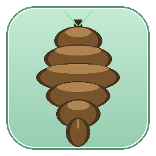
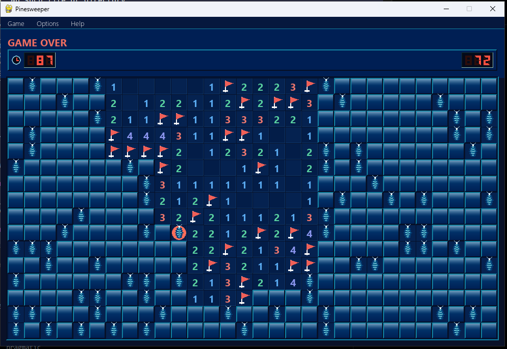
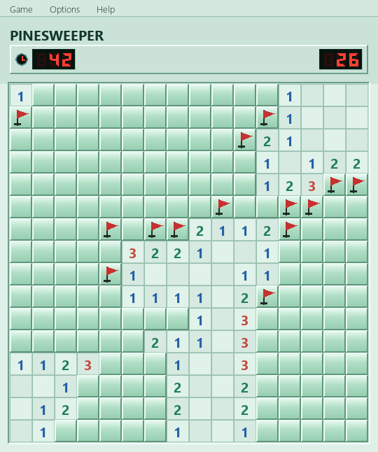
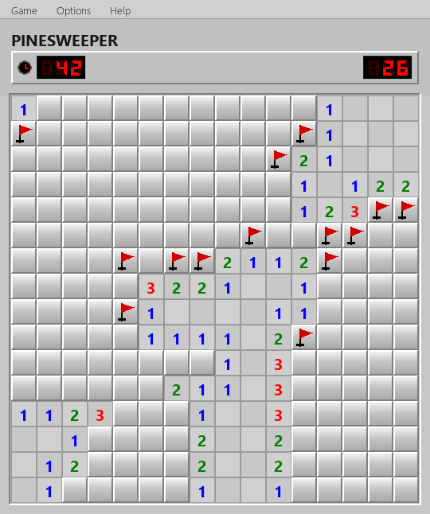
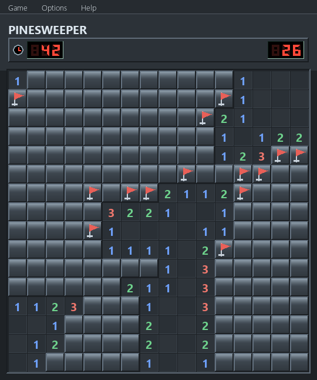
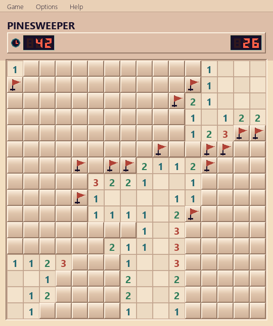
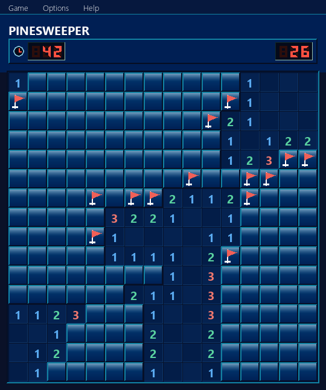

# pinesweeper

Minesweeper in pygame — glossy Win7-style tiles, a pinecone in place of the mine, and five swappable color themes.

<br clear="left">



## Download

Grab the latest **Pinesweeper-win64.zip** from the [Releases page](../../releases), unzip, and run `Pinesweeper.exe` — no Python needed. Your stats and theme are saved in `stats.json` next to the exe.

## Run from source

```
pip install pygame
python main.py
```

## Build the release

```
pip install pyinstaller pillow
python build.py
```

## Controls

- Left-click reveals, right-click flags
- Double-click a number to chord-reveal neighbors
- `R` resets the current board
- `B` / `I` / `E` switch difficulty (Beginner 9×9/10, Intermediate 16×16/40, Expert 16×30/99)
- `S` or click the W-L line to toggle stats overlay

Wins/losses and your chosen theme are stored per-difficulty in `stats.json` (gitignored).

## Themes

Switch via **Options → Theme**. Your selection persists across sessions.

| Pine | Classic |
|:---:|:---:|
|  |  |

| Dark | Coastal |
|:---:|:---:|
|  |  |

| Deep Ocean | |
|:---:|:---:|
|  | |
