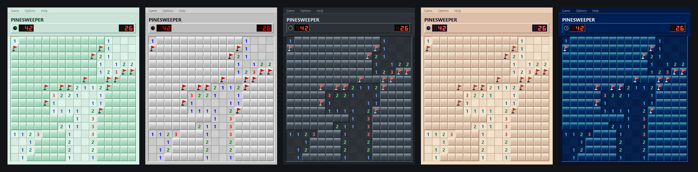

# pinesweeper

Minesweeper reimagined in pygame: forests instead of minefields. Pinecone mines, glossy Win7-style tiles, five swappable color themes, three difficulties, and best-time tracking. Play it in a browser or download the native Windows or macOS app.

<br clear="left">



## Download

Grab the latest package from the [Releases page](../../releases):

- **Pinesweeper-win64.zip**: unzip and run `Pinesweeper.exe`
- **Pinesweeper-macOS.zip**: unzip and run `Pinesweeper.app`
- **Pinesweeper-web.zip**: deploy the extracted folder to any static web host

The desktop packages need no Python installation. Your stats and theme are saved in `stats.json` next to the app.

## Run from source

```
pip install pygame
python main.py
```

## Build a desktop release

```
pip install pyinstaller pillow
python build.py
```

Desktop packages are platform-native, so run the command once on Windows and once on macOS. To build the web app:

```
pip install pygbag
python build_web.py
```

The **Build releases** GitHub Actions workflow builds all three packages automatically.

## Controls

- Left-click reveals; right-click or `Shift` + left-click flags
- Double-click a number to chord-reveal neighbors
- `R` resets the current board
- `B` / `I` / `E` switch difficulty (Beginner 9×9/10, Intermediate 16×16/40, Expert 16×30/99)
- `S` or click the W-L line to toggle stats overlay

Wins/losses and your chosen theme are stored per-difficulty in `stats.json` (gitignored).

## Themes

Switch via **Options → Theme**. Your selection persists across sessions.

| Pine | Classic |
|:---:|:---:|
|  |  |

| Dark | Coastal |
|:---:|:---:|
|  |  |

| Deep Ocean | |
|:---:|:---:|
|  | |
